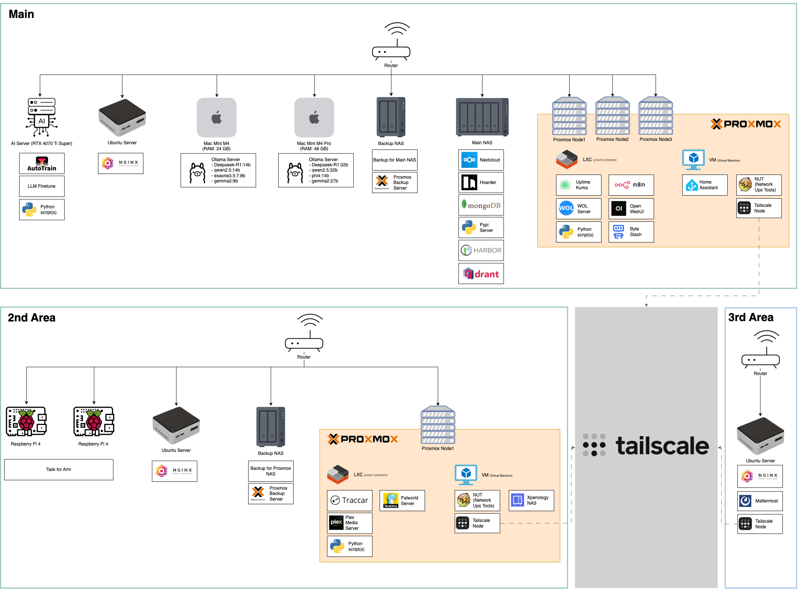

# 💻 Damho Lee

  

## 📃 My Jobs
- Static Analysis Developer
- Web Backend Developer
- Web Infra DevOps Developer

## 📰 CV
- [Click](https://resume.dmomo.net/damho.lee/resume)  

## 📘 Resume
- [Click](https://damho1104.notion.site/8af3191b9815406d95708d9a0cea5a9e)  

## 🌐 Blog
- [IT Blog](https://dmomo.co.kr/)
- [AI Blog](https://blog.ai.dmomo.co.kr/)

## 💪 Technical Skills
### Languages & Frameworks

  
  

  
  
### IDE(s)
 

 
 

### Tools

### OS

## :computer: Stats
  

## My Infra

    

    
    

## 📣 My Service
- [로또 번호 추천 및 당첨 알림 서비스](https://lotto.dmomo.co.kr/)  

## ✅ Latest Blog Post

[2025/04/29 - SKT 유심 해킹 대란: 11일 지연된 통보와 정치권 공방의 전말](https://dmomo.co.kr/358)  
[2025/04/29 - 마이크로소프트의 AI 혁명: 생산성부터 조직구조까지 5가지 핵심 전략](https://dmomo.co.kr/357)  
[2025/04/29 - 이승기 장인 체포: 200억대 주가조작 혐의, 연예계에 미칠 충격은?](https://dmomo.co.kr/356)  
[2025/04/29 - 대구 산불의 충격: 11m 강풍이 부른 252헥타르의 재앙과 대응 전략](https://dmomo.co.kr/355)  
[2025/04/28 - 극적 동점골로 살아난 맨유, 본머스와 1-1 무승부&hellip;유로파 준비 '숨통'](https://dmomo.co.kr/354)  
[2025/04/28 - 맨시티의 마법: FA컵 3연속 결승 진출, 노팅엄 포레스트 2-0 제압](https://dmomo.co.kr/353)  

## ✅ Latest AI Blog Post
[2025/04/29 - SKT SIM Card Hacking Crisis: The Delayed Notification on the 11th and the Political Controversy Behind It](https://blog.ai.dmomo.co.kr/trend/1918)  
[2025/04/29 - SKT 유심 해킹 대란: 11일 지연된 통보와 정치권 공방의 전말](https://blog.ai.dmomo.co.kr/trend/1916)  
[2025/04/29 - Microsoft’s AI Revolution: 5 Key Strategies from Productivity to Organizational Structure](https://blog.ai.dmomo.co.kr/trend/1913)  
[2025/04/29 - 마이크로소프트의 AI 혁명: 생산성부터 조직구조까지 5가지 핵심 전략](https://blog.ai.dmomo.co.kr/trend/1911)  
[2025/04/29 - LG vs Hanwha: A Fiery 9-Game Showdown! Destiny of Title Defense vs Top Contender Challenge?](https://blog.ai.dmomo.co.kr/trend/1908)  
[2025/04/29 - LG vs 한화: 불꽃 튀는 9연전! 선두 수성 vs 상위권 도전의 운명은?](https://blog.ai.dmomo.co.kr/trend/1906)  
