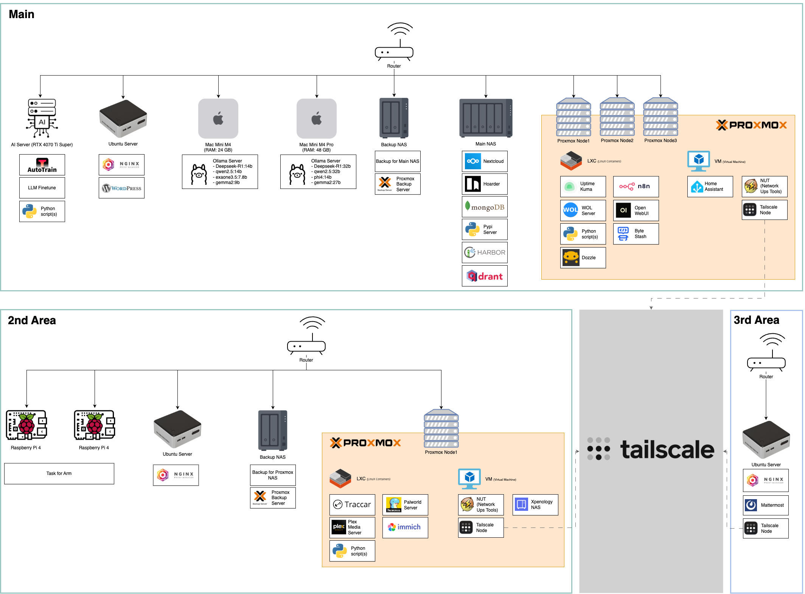

# 💻 Damho Lee

  

## 📃 My Jobs
- Static Analysis Developer
- Web Backend Developer
- Web Infra DevOps Developer

## 📰 CV
- [Click](https://resume.dmomo.net/damho.lee/resume)  

## 📘 Resume
- [Click](https://damho1104.notion.site/8af3191b9815406d95708d9a0cea5a9e)  

## 🌐 Blog
- [IT Blog](https://dmomo.co.kr/)
- [AI Blog](https://blog.ai.dmomo.co.kr/)

## 💪 Technical Skills
### Languages & Frameworks

  
  

  
  
### IDE(s)
 

 
 

### Tools

### OS

## :computer: Stats
  

## My Infra

    

    
    

## 📣 My Service
- [로또 번호 추천 및 당첨 알림 서비스](https://lotto.dmomo.co.kr/)  

## ✅ Latest Blog Post

[2025/05/11 - 골든스테이트 vs 미네소타: 에드워즈의 결정적 3점슛이 바꾼 플레이오프 승부](http://dmomo.co.kr/403)  
[2025/05/11 - 멕시코 축구의 심장을 뛰게 하는 Am&eacute;rica vs. Pachuca 클래식 매치](http://dmomo.co.kr/402)  
[2025/05/11 - 김민재의 철벽수비로 2년 만에 우승한 뮌헨, 그러나 인종차별 논란은?](http://dmomo.co.kr/401)  
[2025/05/11 - 2025년 개발자 최애 노트북은? MacBook Pro vs Dell XPS 비교 가이드](http://dmomo.co.kr/400)  
[2025/05/11 - 하무스의 해트트릭과 이강인의 고민, PSG의 4-1 승리 분석](http://dmomo.co.kr/399)  
[2025/05/11 - 지금 일어난 지진 알아보는 법: 실시간 정보 확인 6가지 꿀팁](http://dmomo.co.kr/398)  

## ✅ Latest AI Blog Post
[2025/05/11 - Golden State vs Minnesota: How Edwards’ Clutch Three-Pointer Changed the Playoff Battle](https://blog.ai.dmomo.co.kr/trend/2165)  
[2025/05/11 - 골든스테이트 vs 미네소타: 에드워즈의 결정적 3점슛이 바꾼 플레이오프 승부](https://blog.ai.dmomo.co.kr/trend/2163)  
[2025/05/11 - The Classic Match that Drives the Heart of Mexican Soccer: América vs. Pachuca](https://blog.ai.dmomo.co.kr/trend/2160)  
[2025/05/11 - 멕시코 축구의 심장을 뛰게 하는 América vs. Pachuca 클래식 매치](https://blog.ai.dmomo.co.kr/trend/2158)  
[2025/05/11 - Bayern Munich Wins After Two Years, Thanks to Kim Min-Jae’s Solid Defense, But Controversy of Racism Arises?](https://blog.ai.dmomo.co.kr/trend/2155)  
[2025/05/11 - 김민재의 철벽수비로 2년 만에 우승한 뮌헨, 그러나 인종차별 논란은?](https://blog.ai.dmomo.co.kr/trend/2153)  
